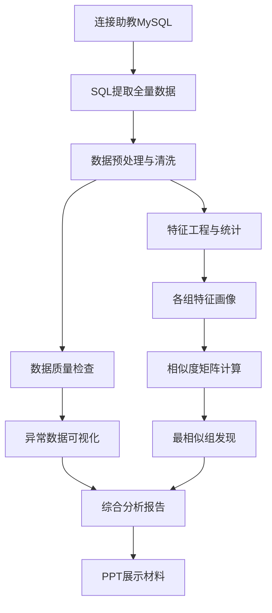

# 作业四：多组教务数据集成分析与可视化—方案与分工文档

\> **组号**: 16

\> **作业三项目**: 基于XML的异构教务数据集成系统（路线1）

\> **作业四任务**: 基于服务器收集的各组作业3数据进行数据探索（异常数据发现和可视化）和数据分析（评估各组数据特点、找到和本组数据特征最接近的组等）


---


## **一、背景与目标**


### **1\.1 数据来源**


作业三各组已将本地数据上传至助教统一 MySQL 服务器：

|项目|内容|
|---|---|
|主机|`10.60.254.44`|
|端口|`3306`|
|数据库|`hw4`|
|用户/密码|`root` / `123456`|
|本组组号|`16`|


包含三张表：`student`、`course`、`sc`，每条记录含 `group_no`（组号）和 `dept_no`（A/B/C）字段，可区分各组各院系的数据。


### **1\.2 本组（16号）数据特征概览**


|维度|学院A|学院B|学院C|
|---|---|---|---|
|学生数|50|50|50|
|课程数|10|10|10|
|选课记录|250|250|250|
|学号格式|A001\-A050|B001\-B050|C001\-C050|
|课程编号|A101\-A110|B101\-B110|C101\-C110|
|学分|全3|全3|全3|
|共享比例|\~70%（N=30%）|\~70%|\~70%|
|性别分布|M25/F25|M25/F25|M25/F25|
|成绩|全NULL|全NULL|全NULL|


### **1\.3 作业四目标**


1\. **数据探索**: 连接服务器，获取所有组数据，进行数据质量检查与异常发现，并可视化展示

2\. **数据分析**: 评估各组数据特征，设计相似度度量方法，找到与本组（16号）数据特征最接近的组

3\. **数据挖掘拓展**: 可额外进行课程热度分析、选课关联规则挖掘等


---


## **二、技术方案**


### 2.1 技术选型


|环节|技术|说明|
|---|---|---|
|数据获取|Python \+ SQLAlchemy / pymysql|连接助教 MySQL 获取全量数据|
|数据处理|Pandas、NumPy|数据清洗、转换、统计|
|异常检测|Pandas profiling / 自编校验规则|缺失值、重复值、格式异常|
|相似度计算|Scikit\-learn（余弦相似度、欧氏距离）|多维特征向量比较|
|可视化|Matplotlib \+ Seaborn|柱状图、饼图、热力图、雷达图等|
|报告|Jupyter Notebook / Markdown|可复现的分析流程|


\> **语言选择说明**: 作业三使用 Java 完成系统开发。作业四为纯数据分析任务，使用 Python 生态（Pandas \+ Matplotlib \+ Scikit\-learn）更适合数据处理与可视化，效率更高。


### 2.2 分析流程



### 2.3 特征工程维度

从三张表中提取以下特征用于组间相似度比较：

|特征类别|具体特征|
|---|---|
|规模特征|学生总数、课程总数、选课总数、选课/学生比|
|结构特征|各院学生分布比例、各院课程分布比例|
|内容特征|学号格式（长度/前缀）、课程编号模式、学分均值|
|共享特征|共享课程比例、各院共享比例差异|
|性别特征|整体男女比、各院男女比|
|成绩特征|有成绩记录占比、成绩分布统计（若有）|

### 2\.4  github项目目录参考

```Python
├── analysis/          # 作业4 新增
│   ├── data/          # 导出的 CSV 数据（.gitignore 可考虑）
│   ├── figures/       # 可视化图表输出
│   ├── fetch_data.py
│   ├── preprocess.py
│   ├── anomaly_detection.py
│   ├── statistical_analysis.py
│   ├── visualization.py
│   └── requirements.txt
├── projects/          # 作业3 原有
├── docs/              # 作业3 原有
├── scripts/           # 作业3 原有
├── pom.xml            # 作业3 原有
└── README.md          # 可更新加入作业4说明
```

---


## **三、详细任务分解**


### **成员1：项目经理 \& 报告主笔**


**职责**:

- 制定作业四整体方案与时间计划

- 编写最终分析报告（含研究背景、方法、结果、结论）

- 整合各成员产出物，统一格式与风格

- 绘制整体分析流程图、架构图

- 质量把控：确保报告逻辑完整、图表清晰、结论有据

**交付物**:

- 作业四方案

- 最终分析报告（`.md` \+ `.pdf`）

- 分析流程图（不少于2张）

---

### **成员2：数据获取与预处理**


**职责**:

- 编写 Python 脚本连接助教 MySQL 服务器（`10.60.254.44:3306/hw4`）

- 从 `student`、`course`、`sc` 三张表中提取所有组（所有 group\_no）的全量数据

- 导出为本地 CSV 文件，供团队共享使用

- 数据初步清洗：检查编码问题、NULL 处理、格式统一

- 编写数据字典，说明各字段含义和取值范围

**交付物**:

- 数据获取脚本（`fetch_data.py`）

- 导出数据文件（`data/students.csv`、`data/courses.csv`、`data/sc.csv`）

- 数据字典文档

- 数据预处理脚本（`preprocess.py`）

---


### **成员3：数据探索与异常发现**


**职责**:

- 对各组数据进行全面质量检查：

    - 缺失值分析：哪些组缺少数据、哪些字段有空值

    - 重复值检查：重复学号、重复课程编号、重复选课记录

    - 格式异常：学号/课程编号格式不一致、字段长度超限

    - 数量异常：学生数/课程数/选课数偏离预期的组

    - 逻辑异常：选课记录指向不存在的学生或课程

- 编写异常检测报告，列出所有发现的问题

- 制作异常数据可视化图表（缺失值热力图、异常值分布图等）

**交付物**:

- 异常检测脚本（`anomaly_detection.py`）

- 异常数据可视化图表（≥4张）

- 异常检测报告（含异常清单与建议）

---


### **成员4：统计分析与相似度计算**


**职责**:

- 计算各组核心统计指标：

    - 各组三个学院学生数、课程数、选课数

    - 各组共享课程比例、性别比、学分分布

    - 各组学号编码特征（前缀、长度、模式）

- 构建多维特征向量，对每组进行特征画像

- 设计相似度计算方法（如余弦相似度、欧氏距离），计算组间相似度矩阵

- 找到与本组（16号）最相似的组，分析相似原因

- 可拓展：聚类分析（K\-Means/Hierarchical），发现组的自然分类

**交付物**:

- 统计分析脚本（`statistical_analysis.py`）

- 各组特征画像表

- 组间相似度矩阵

- 最相似组分析报告

---


### **成员5：数据可视化**


**职责**:

- 设计并制作全套分析可视化图表，涵盖：

    - 各组数据规模对比（柱状图/分组柱状图）

    - 各组院系分布（堆叠柱状图）

    - 各组共享课程比例对比（条形图）

    - 各组男女比例对比（饼图或分组条形图）

    - 组间相似度热力图

    - 本组（16号）与最相似组的雷达图对比

    - 异常数据分布展示

- 确保图表配色统一、标注清晰、可直接用于报告和 PPT

- 统一图表风格与中文字体适配

**交付物**:

- 可视化脚本（`visualization.py`）

- 全套图表（≥10张，PNG 格式，300dpi）

- 图表标题与说明清单

---


### **成员6：综合分析（与 PPT 制作）**

（ppt未明确需要，若有则为成员6任务之一）

**职责**:

- 整合数据分析结论，撰写综合性分析解读：

    - 各组数据特点总结（按数据质量、设计风格分类）

    - 本组（16号）数据特征在全体中的定位

    - 最相似组的深度对比分析

    - 对其他组的建议（如数据格式优化建议）

- 制作展示 PPT（10\-15页），包含：

    - 项目概述

    - 数据来源与方法

    - 关键发现与图表

    - 相似组分析

    - 结论与总结

- 组织演示排练

**交付物**:

- 综合分析解读文档

- 展示 PPT（`.pptx`）

- 演示讲稿/要点

---


## **四、时间计划**

0\.5\+1\+2\+1\+1\+0\.5 = 6天

|阶段|任务|负责人|预计天数|
|---|---|---|---|
|1|方案确认、环境搭建|全员|0\.5天|
|2|数据获取与预处理|成员2|1天|
|3|数据探索与异常检测|成员3|2天|
|3|统计分析与相似度计算|成员4|2天|
|3|数据可视化|成员5|2天|
|4|综合分析|成员6|1天|
|5|报告汇总与整合|成员1|1天|
|5|PPT 制作与演示准备（待定）|成员6、全员|1天|
|6|最终审查与提交|全员|0\.5天|


> 阶段2\-4中，成员3、4、5可并行工作（等成员2提供数据后即可开始）。
> 
> 


---


## **五、协作约定**


### **5\.1 代码与文件规范**


- Python 脚本统一放在 `analysis/` 目录下

- 数据文件统一放在 `analysis/data/` 目录下

- 图表输出统一放在 `analysis/figures/` 目录下

- 所有脚本使用 UTF\-8 编码，中文注释

- 依赖包写入 `analysis/requirements.txt`

### **5\.2 依赖传递关系**


```Plain Text
成员2（数据获取） → 成员3（异常检测）、成员4（统计分析）
                              ↓
                        成员5（可视化）
                              ↓
                   成员6（综合分析）、成员1（报告）
```


### **5\.3 交付物汇总**


|成员|核心交付物|
|---|---|
|成员1|最终分析报告、流程图、方案文档|
|成员2|数据获取脚本、导出CSV、数据字典|
|成员3|异常检测脚本、异常报告、异常图表|
|成员4|统计分析脚本、特征画像、相似度矩阵|
|成员5|可视化脚本、全套图表|
|成员6|综合分析文档、PPT|


---


## **六、验收标准**


1. 成功连接服务器获取所有组数据，数据完整可用

2. 完成各组数据质量检查，输出异常清单和可视化图表

3. 完成各组数据特征统计与对比分析

4. 计算组间相似度，明确给出与本组（16号）最相似的组及理由

5. 可视化图表不少于10张，覆盖数据对比、异常、相似度等方面

6. 最终报告结构完整，包含数据探索、分析过程、结论

7. PPT 展示内容清晰，可支撑课堂演示

