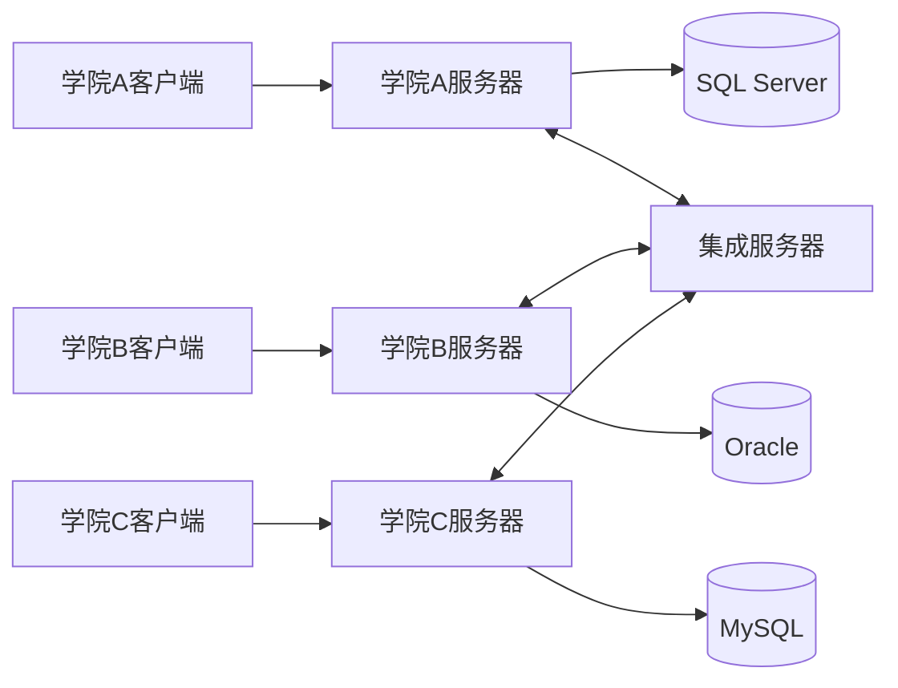
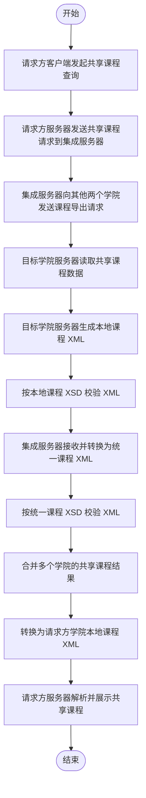
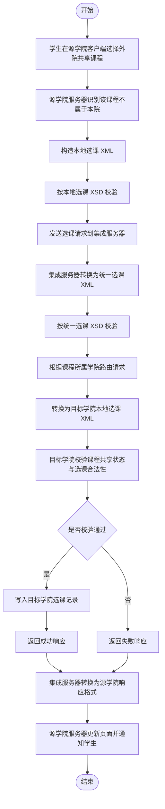
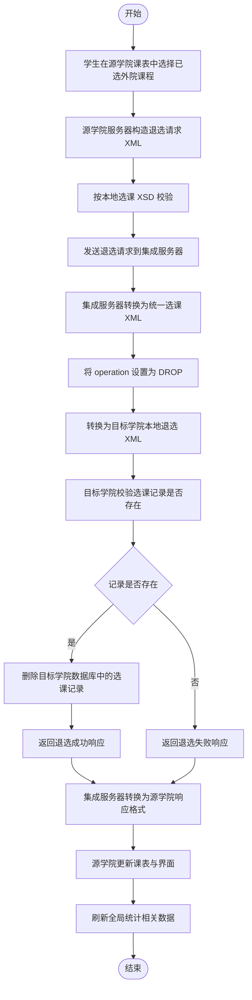
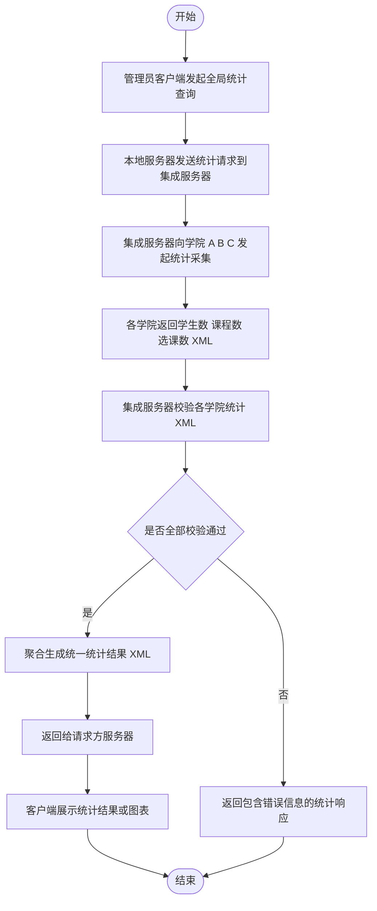

# 基于 XML 的异构教务数据集成系统系统架构设计文档

## 1. 文档概述

### 1.1 编写目的

本文档用于统一描述本项目的需求分析与设计、系统总体架构、XML 接口定义、核心业务流程以及项目进度管理方案。本文档面向成员 2 至成员 6 的后续实现工作，作为各模块开发、联调和验收的统一依据。

### 1.2 项目背景

本项目面向学院 A、学院 B、学院 C 三个已有教务系统的数据集成场景。三个学院分别使用 SQL Server、Oracle、MySQL 数据库，现有系统之间数据结构、字段命名、业务规则均存在差异。项目目标是在尽量少改动各学院本地系统的前提下，新增集成服务器，实现以下跨系统能力：

1. 跨学院共享课程查询。
2. 跨学院选课。
3. 跨学院退选课。
4. 全局统计查询。

### 1.3 文档范围

本文档包含以下内容：

1. 需求分析与系统设计目标。
2. 系统总体架构与模块职责划分。
3. 统一数据模型与 XML 接口定义。
4. 四类核心业务流程图。
5. 项目进度管理与协作机制。

## 2. 需求分析

### 2.1 原有系统现状

三个学院原有教务系统均可独立完成本院登录、课程管理、选课管理等业务，但各系统相互独立，无法直接支持跨学院课程共享与选课。现有异构性主要体现在以下三个方面：

1. 数据库异构：学院 A 使用 SQL Server，学院 B 使用 Oracle，学院 C 使用 MySQL。
2. 模式异构：三套系统的学生、课程、选课、账户表在表名、字段名、长度、数据类型、约束方式上均不一致。
3. 业务异构：学生数据互不重叠，课程存在部分重合，课程共享规则和选课规则存在差异。

### 2.2 目标需求

根据作业分工文档和参考文档，本项目需要满足以下业务要求：

1. 每个学院系统可独立登录，并查看本校课程和共享课程。
2. 学院学生可发起跨院选课请求，并在目标学院数据库中生成选课记录。
3. 学生可退选已经选择的跨院课程，并同步更新双方记录。
4. 集成服务器能够返回学院 A、B、C 的全局学生数、课程数、选课数。
5. 所有跨系统数据交换均采用 XML，并经过 XSD 验证和格式转换。
6. 系统需要输出课程共享、跨院选课、退选课、全局统计四类核心流程设计。

### 2.3 设计原则

为保证系统可实现、可联调、可扩展，本文档采用以下设计原则：

1. 保留各学院本地系统主体结构，只新增 XML 通信与解析能力。
2. 所有跨系统数据先转换为统一 XML 格式，再转换为目标学院格式。
3. 所有跨系统请求必须可校验、可追踪、可回执。
4. 通过集成服务器屏蔽异构细节，避免学院之间直接耦合。

## 3. 系统总体架构设计

### 3.1 架构目标

系统总体架构的设计目标是将跨学院数据交换、格式转换、请求路由等复杂性收敛到集成服务器，使三个学院只需要围绕本地业务逻辑和本地数据库进行开发。

### 3.2 总体架构说明

系统由四部分组成：

1. 学院客户端。
2. 学院本地服务器。
3. 各学院本地数据库。
4. 集成服务器。

各学院客户端仅与本院服务器通信；各学院服务器负责本地业务处理与 XML 数据生成解析；集成服务器负责跨院请求的接收、验证、转换、转发、聚合与回执。

### 3.3 架构图

### 3.4 模块职责划分

#### 3.4.1 学院客户端

学院客户端需要提供学生端和管理员端功能。

学生端功能：

1. 登录。
2. 查看本院课程。
3. 查看共享课程。
4. 发起跨院选课。
5. 发起跨院退选。
6. 查看个人课表。

管理员端功能：

1. 登录。
2. 课程共享标记设置。
3. 本地课程管理。
4. 调用全局统计结果展示。

#### 3.4.2 学院本地服务器

学院本地服务器负责：

1. 本地登录认证。
2. 本地数据库访问。
3. 本校课程选课和退课处理。
4. 本地 XML 生成与解析。
5. 本地 XSD 校验。
6. 向集成服务器发起共享课程、跨院选课、跨院退选、统计请求。
7. 接收集成服务器回传结果并更新本地界面或数据。

#### 3.4.3 集成服务器

集成服务器负责：

1. 接收学院系统发送的跨院请求。
2. 基于 XSD 对 XML 进行结构校验。
3. 基于 XSLT 将本地 XML 转换为统一 XML。
4. 根据课程所属学院进行请求路由。
5. 聚合其他学院共享课程数据。
6. 汇总全局统计信息。
7. 将统一 XML 再转换为目标学院本地 XML。
8. 返回成功、失败、校验异常、系统异常等回执。

### 3.5 部署关系与通信方式

1. 每个学院拥有独立客户端、独立服务器、独立数据库。
2. 三个学院服务器通过 HTTP 与集成服务器通信。
3. 数据交换格式统一为 XML。
4. 新实现建议统一采用 UTF-8 编码，避免参考资料中 GB2312 带来的兼容问题。

## 4. 数据与接口设计

### 4.1 设计思路

由于三个学院的本地数据结构不同，系统采用“本地格式 XML -> 统一格式 XML -> 目标院系格式 XML”的双向转换机制。所有跨系统请求必须经过以下处理链路：

1. 按发送方本地 XSD 校验。
2. 转换为统一 XML 格式。
3. 按统一 XSD 校验。
4. 执行业务路由、聚合或统计。
5. 转换为接收方本地 XML 格式。
6. 按接收方本地 XSD 校验。

### 4.2 统一数据模型定义

本项目定义三类统一实体：学生、课程、选课。

#### 4.2.1 统一学生模型

| 统一字段 | 含义       | 类型   | 是否必填 | 说明                      |
| -------- | ---------- | ------ | -------- | ------------------------- |
| id       | 学号       | string | 是       | 与 college 组合后全局唯一 |
| name     | 姓名       | string | 是       | 最大长度 40               |
| sex      | 性别       | string | 是       | 统一取值为 M、F、U        |
| major    | 专业或院系 | string | 是       | 最大长度 40               |
| college  | 所属学院   | string | 是       | 取值 A、B、C              |
| account  | 账户名     | string | 否       | 学院 A 本地格式需要       |

#### 4.2.2 统一课程模型

| 统一字段 | 含义     | 类型          | 是否必填 | 说明             |
| -------- | -------- | ------------- | -------- | ---------------- |
| id       | 课程编号 | string        | 是       | 在所属学院内唯一 |
| name     | 课程名称 | string        | 是       | 最大长度 40      |
| time     | 课时     | unsignedShort | 否       | 学院 A 可为空    |
| score    | 学分     | unsignedByte  | 是       | 建议取值 0 到 10 |
| teacher  | 授课教师 | string        | 是       | 最大长度 20      |
| location | 授课地点 | string        | 是       | 最大长度 40      |
| college  | 所属学院 | string        | 是       | 取值 A、B、C     |
| share    | 共享标记 | string        | 是       | 取值 Y、N        |

#### 4.2.3 统一选课模型

| 统一字段       | 含义         | 类型         | 是否必填 | 说明                          |
| -------------- | ------------ | ------------ | -------- | ----------------------------- |
| sid            | 学生编号     | string       | 是       | 发起请求学生                  |
| cid            | 课程编号     | string       | 是       | 目标课程                      |
| requestCollege | 请求方学院   | string       | 是       | 取值 A、B、C                  |
| ownerCollege   | 课程所属学院 | string       | 是       | 取值 A、B、C                  |
| score          | 成绩         | unsignedByte | 否       | 查询或回执时可带回            |
| operation      | 操作类型     | string       | 是       | 取值 ENROLL、DROP             |
| status         | 处理状态     | string       | 否       | 取值 PENDING、SUCCESS、FAILED |
| traceId        | 请求跟踪号   | string       | 是       | 跨系统全链路唯一              |

### 4.3 字段映射关系

#### 4.3.1 学生字段映射

| 统一字段 | 学院 A   | 学院 B | 学院 C | 转换规则            |
| -------- | -------- | ------ | ------ | ------------------- |
| id       | 学号     | 学号   | Sno    | 直接映射            |
| name     | 姓名     | 姓名   | Snm    | 直接映射            |
| sex      | 性别     | 性别   | Sex    | 统一规范为 M、F、U  |
| major    | 院系     | 专业   | Sde    | 直接映射            |
| college  | 常量 A   | 常量 B | 常量 C | 由发送方补充        |
| account  | 关联账户 | 无     | 无     | 学院 A 专用可选字段 |

#### 4.3.2 课程字段映射

| 统一字段 | 学院 A   | 学院 B | 学院 C | 转换规则        |
| -------- | -------- | ------ | ------ | --------------- |
| id       | 课程编号 | 编号   | Cno    | 直接映射        |
| name     | 课程名称 | 名称   | Cnm    | 直接映射        |
| time     | 无       | 课时   | Ctm    | 学院 A 可缺省   |
| score    | 学分     | 学分   | Cpt    | 统一转为整数    |
| teacher  | 授课老师 | 老师   | Tec    | 直接映射        |
| location | 授课地点 | 地点   | Pla    | 直接映射        |
| college  | 常量 A   | 常量 B | 常量 C | 由发送方补充    |
| share    | 共享     | 共享   | Share  | 统一规范为 Y、N |

#### 4.3.3 选课字段映射

| 统一字段       | 学院 A       | 学院 B       | 学院 C       | 转换规则                        |
| -------------- | ------------ | ------------ | ------------ | ------------------------------- |
| sid            | 学生编号     | 学号         | Sno          | 直接映射                        |
| cid            | 课程编号     | 课程编号     | Cno          | 直接映射                        |
| requestCollege | 调用方学院   | 调用方学院   | 调用方学院   | 由请求元数据补充                |
| ownerCollege   | 目标学院     | 目标学院     | 目标学院     | 由请求元数据补充                |
| score          | 成绩         | 得分         | Grd          | 统一转为整数                    |
| operation      | 本地操作类型 | 本地操作类型 | 本地操作类型 | 映射为 ENROLL、DROP             |
| status         | 本地处理结果 | 本地处理结果 | 本地处理结果 | 映射为 PENDING、SUCCESS、FAILED |
| traceId        | 请求流水号   | 请求流水号   | 请求流水号   | 由源系统生成并全程透传          |

### 4.4 XML Schema 规范清单

本项目采用完整的 12 个 XSD 方案，分为统一格式 XSD 与本地格式 XSD 两类。

#### 4.4.1 统一格式 XSD

1. `schema/unified/formatStudent.xsd`：统一学生格式。
2. `schema/unified/formatClass.xsd`：统一课程格式。
3. `schema/unified/formatClassChoice.xsd`：统一选课格式。

#### 4.4.2 本地格式 XSD

学院 A：

1. `schema/local/studentA.xsd`
2. `schema/local/classA.xsd`
3. `schema/local/choiceA.xsd`

学院 B：

1. `schema/local/studentB.xsd`
2. `schema/local/classB.xsd`
3. `schema/local/choiceB.xsd`

学院 C：

1. `schema/local/studentC.xsd`
2. `schema/local/classC.xsd`
3. `schema/local/choiceC.xsd`

### 4.5 接口消息分类

跨系统接口至少支持以下消息类型：

1. 共享课程查询请求。
2. 共享课程查询响应。
3. 跨院选课请求。
4. 跨院选课响应。
5. 跨院退选请求。
6. 跨院退选响应。
7. 全局统计请求。
8. 全局统计响应。
9. 校验失败响应。
10. 系统异常响应。

### 4.6 接口元数据要求

所有跨系统请求与响应必须包含或可推导出以下元数据：

1. `traceId`
2. sourceSystem
3. targetSystem
4. messageType
5. schemaVersion
6. timestamp

若消息体未直接携带全部字段，则由 HTTP 头或网关层补足。

### 4.7 响应规则与错误码

#### 4.7.1 成功响应

成功响应至少应包含：

1. `traceId`
2. `operation`
3. `status=SUCCESS`
4. 目标课程编号或统计结果
5. 可读消息文本

#### 4.7.2 失败响应

失败响应至少应包含：

1. `traceId`
2. `operation`
3. `status=FAILED`
4. `errorCode`
5. 可读错误信息

#### 4.7.3 基线错误码

| 错误码  | 含义               |
| ------- | ------------------ |
| VAL-001 | 缺少必填元素       |
| VAL-002 | 枚举值非法         |
| VAL-003 | 字段长度非法       |
| BIZ-001 | 重复选课           |
| BIZ-002 | 课程未开放共享     |
| BIZ-003 | 课程不存在         |
| BIZ-004 | 退选目标记录不存在 |
| SYS-001 | 下游调用超时       |
| SYS-002 | XML 转换失败       |
| SYS-003 | 未知系统异常       |

### 4.8 接口冻结原则

1. 所有 XSD 在联调前冻结。
2. 冻结后若需修改，必须同步更新字段映射、流程说明和实现说明。
3. 成员 2、3、4 的本地 XML 生成和解析必须严格按照对应本地 XSD 执行。
4. 成员 5、6 的集成服务器实现必须严格按照统一 XSD 和映射规则执行。

## 5. 核心业务流程设计

### 5.1 课程共享流程

#### 5.1.1 处理说明

课程共享流程用于查询其他学院已开放共享的课程。集成服务器负责向其他学院拉取课程 XML，进行统一格式转换、合并，再转换为请求方学院的本地格式返回。

#### 5.1.2 处理步骤

1. 请求方学院用户在客户端发起共享课程查询。
2. 请求方学院服务器向集成服务器发送共享课程请求。
3. 集成服务器向另外两个学院服务器发送课程导出请求。
4. 目标学院服务器读取本地课程表中共享标记为 Y 的课程数据。
5. 目标学院服务器生成本地课程 XML，并按本地 XSD 校验。
6. 集成服务器接收 XML，转换为统一课程 XML，并按统一 XSD 校验。
7. 集成服务器合并共享课程结果集。
8. 集成服务器将合并后的统一 XML 转换为请求方学院课程 XML。
9. 请求方学院解析结果并展示或保存共享课程。

#### 5.1.3 流程图

#### 5.1.4 控制点

1. 仅返回共享标记为 Y 的课程。
2. 同一来源的重复课程必须去重。
3. 校验失败时必须返回 `traceId` 和失败的 XSD 名称。

### 5.2 跨院选课流程

#### 5.2.1 处理说明

当学生在本院系统选择其他学院开放共享的课程时，本院服务器将请求发送给集成服务器，由集成服务器完成格式转换和请求转发，再由目标学院执行选课有效性校验并落库。

#### 5.2.2 处理步骤

1. 学生在本院客户端选择外院共享课程。
2. 本院服务器识别目标课程不属于本院。
3. 本院服务器构造本地选课 XML。
4. 本院服务器按本地 XSD 校验后发送给集成服务器。
5. 集成服务器将其转换为统一选课 XML，并按统一 XSD 校验。
6. 集成服务器根据课程所属学院进行路由。
7. 集成服务器转换为目标学院本地选课 XML。
8. 目标学院服务器校验课程是否共享、是否重复选课、课程是否存在。
9. 校验通过后，目标学院在本地数据库写入选课记录。
10. 目标学院返回成功或失败响应。
11. 集成服务器将响应转换为源学院格式并回传。
12. 本院服务器更新页面并告知学生结果。

#### 5.2.3 流程图

#### 5.2.4 控制点

1. 重复选课返回 `BIZ-001`。
2. 非共享课程返回 `BIZ-002`。
3. 所有请求与响应必须保持同一个 `traceId`。

### 5.3 跨院退选流程

#### 5.3.1 处理说明

退选流程与跨院选课流程相反，由源学院发起退选请求，集成服务器负责转换和转发，目标学院负责删除已有的选课记录，并将结果回传源学院。

#### 5.3.2 处理步骤

1. 学生在本院课表中选择已选的外院课程。
2. 本院服务器构造退选请求 XML。
3. 本院服务器按本地 XSD 校验后发送至集成服务器。
4. 集成服务器将其转换为统一选课 XML，并将 `operation` 设为 `DROP`。
5. 集成服务器根据课程所属学院转换为目标学院本地 XML。
6. 目标学院校验该选课记录是否存在。
7. 若记录存在，则删除目标学院数据库中的选课记录。
8. 目标学院将退选结果回传集成服务器。
9. 集成服务器转换后回传源学院。
10. 源学院更新本地课表和界面。
11. 退选成功后应刷新统计数据。

#### 5.3.3 流程图

#### 5.3.4 控制点

1. 对不存在的选课记录退选时返回 `BIZ-004`。
2. 跨院退选场景中 `requestCollege` 与 `ownerCollege` 不能相同。
3. 每次成功退选后，统计数据必须保持一致。

### 5.4 全局统计流程

#### 5.4.1 处理说明

全局统计功能由管理员触发，集成服务器向三个学院收集学生总数、课程总数、选课总数，再聚合为统一 XML 响应返回。

#### 5.4.2 处理步骤

1. 管理员在本地管理端发起全局统计查询。
2. 本院服务器向集成服务器发送统计请求。
3. 集成服务器向学院 A、B、C 发送统计采集请求，或读取已同步的统计汇总结果。
4. 各学院返回本院学生数、课程数、选课数 XML。
5. 集成服务器分别校验各学院 XML。
6. 集成服务器生成统一统计结果 XML。
7. 请求方展示统计数据或绘制图表。

#### 5.4.3 流程图

#### 5.4.4 返回结果要求

统计结果至少包含以下字段：

1. 学院名称。
2. 学生总数。
3. 课程总数。
4. 选课总数。
5. 统计生成时间。

## 6. 进度管理与协作安排

### 6.1 阶段划分

结合分工文档中已有阶段安排，将项目执行细化为以下里程碑：

1. 第 1 至 2 天：完成需求确认、统一数据模型、字段映射、XSD 列表冻结。
2. 第 3 至 5 天：成员 2、3、4 并行开发各学院本地系统；成员 5 并行开发集成服务器核心功能。
3. 第 6 天：组织接口冻结评审和 XSD 评审。
4. 第 7 至 8 天：完成课程共享和跨院选课联调。
5. 第 9 天：完成退选课和全局统计联调。
6. 第 10 天：整理演示材料与最终说明内容。

### 6.2 成员一职责边界

成员一在项目中的职责是“架构与规范负责人”，主要承担：

1. 统一需求和设计口径。
2. 定义 XML 接口与 XSD 规范。
3. 输出流程图与架构图。
4. 组织接口评审和阶段检查。

### 6.3 各成员需回填的材料

成员 2 需提供：

1. SQL Server 建表语句与初始数据说明。
2. 学院 A 请求与响应 XML 示例。
3. 学院 A GUI 截图。

成员 3 需提供：

1. Oracle 建表语句与初始数据说明。
2. 学院 B 请求与响应 XML 示例。
3. 学院 B GUI 截图。

成员 4 需提供：

1. MySQL 建表语句与初始数据说明。
2. 学院 C 请求与响应 XML 示例。
3. 学院 C GUI 截图。

成员 5 需提供：

1. 集成服务器接口清单。
2. XSD 校验与 XSLT 转换实现说明。
3. 课程共享与跨院选课联调结果。

成员 6 需提供：

1. 全局统计接口定义与结果样例。
2. 跨院退选联调结果。
3. 异常场景测试记录。

### 6.4 评审与控制点

为减少联调返工，项目设置三个关键检查点：

1. Schema 评审：检查统一模型是否稳定，字段映射是否完整。
2. 联调准入评审：检查各成员能否生成符合 XSD 的 XML。
3. 验收前评审：检查课程共享、跨院选课、退选课、统计结果是否均有证据支撑。

## 7. 风险与约束

### 7.1 主要风险

1. 字段含义理解不一致导致 XSLT 映射错误。
2. 编码不统一导致 XML 解析失败。
3. 接口冻结前后频繁改动导致联调失败。
4. 重复选课和退选不存在记录等异常场景处理不完整。
5. 退选后统计数据未同步更新导致结果错误。

### 7.2 控制措施

1. 在联调前冻结 XSD 和字段映射。
2. 新实现统一使用 UTF-8 编码。
3. 所有请求与响应强制携带 `traceId`。
4. 集成服务器不得直接操作学院本地数据库。
5. 所有失败场景必须返回结构化 XML 回执。
