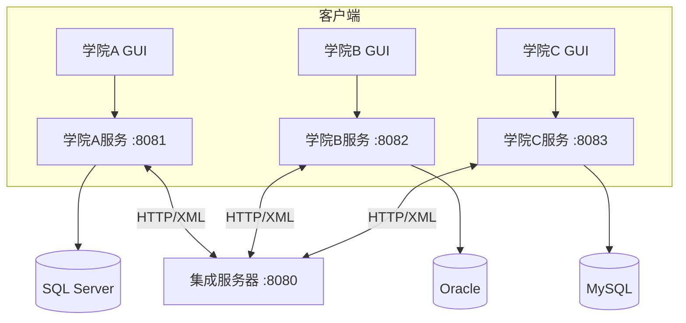
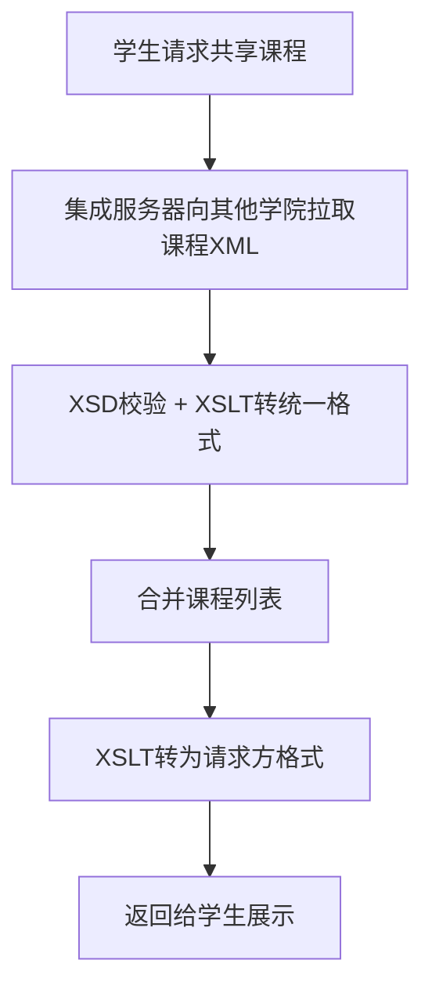
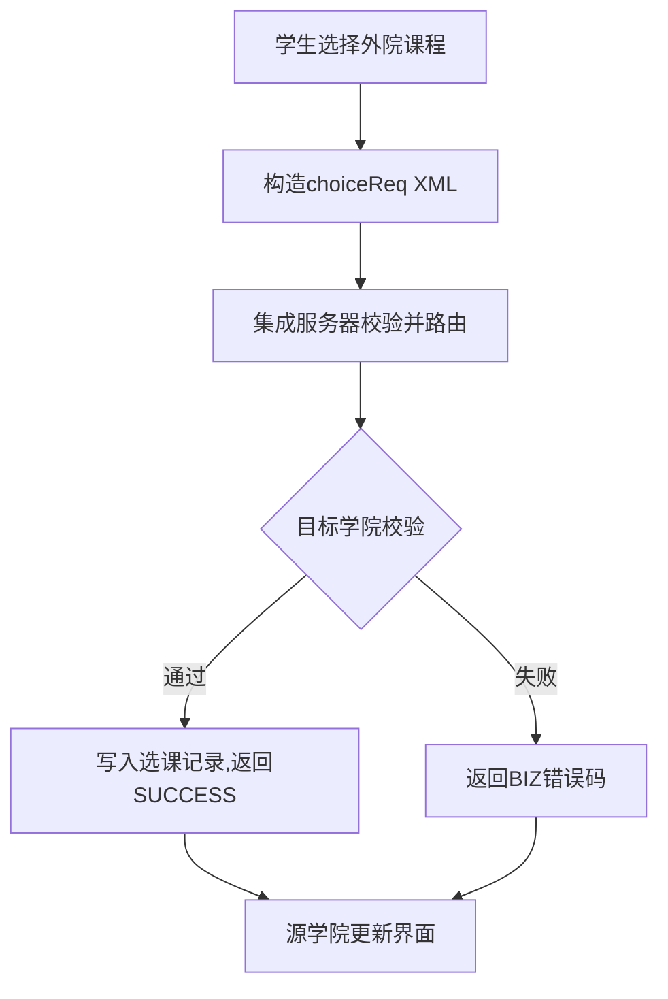
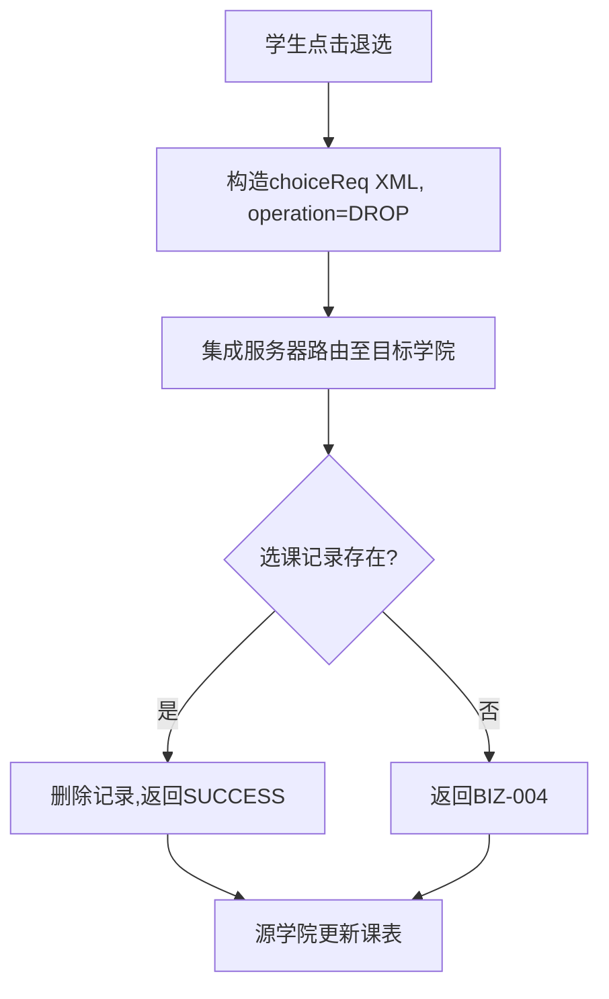
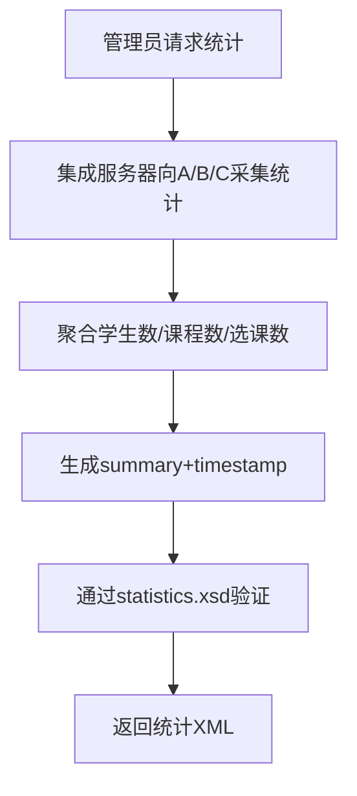

# 基于XML的异构教务数据集成系统

## 实验报告

---

> **课程名称**：数据集成  
> **项目名称**：基于XML的异构教务数据集成系统  
> **小组人数**：6人  

---

### 摘要

本项目基于XML技术，实现学院A、B、C三个异构教务系统的数据集成。三个学院分别使用SQL Server、Oracle、MySQL数据库。通过新增集成服务器，实现了跨学院课程共享查询、跨院选课、跨院退选及全局统计功能。系统采用"本地格式XML → 统一格式XML → 目标格式XML"的双向转换机制，利用XSD校验和XSLT转换，所有跨系统数据交换均以XML/HTTP完成。经集成测试验证，12项测试用例（20个验证点）全部通过，通过率100%。

**关键词**：XML；数据集成；异构数据库；XSD；XSLT；教务系统

---

## 1. 项目概述

### 1.1 背景与目标

三个学院分别使用不同数据库（SQL Server / Oracle / MySQL），字段命名风格各异。本项目通过集成服务器实现：
1. 跨学院共享课程查询
2. 跨学院选课（目标学院落库）
3. 跨学院退选（目标学院删除记录）
4. 全局统计（三院学生数/课程数/选课数汇总）

### 1.2 技术选型

| 要素 | 选型 |
|------|------|
| 语言 | Java（JDK 8+） |
| 数据库 | SQL Server / Oracle / MySQL |
| XML处理 | DOM4J、javax.xml |
| 格式校验 | XSD |
| 格式转换 | XSLT 1.0 |
| 通信 | HTTP（com.sun.net.httpserver） |
| GUI | Java Swing |
| 构建 | Maven |

### 1.3 分工

| 成员 | 职责 |
|------|------|
| 韩乐妍 | 架构设计、接口定义、XSD、流程图、报告 |
| 沈易 | 学院A（SQL Server + GUI） |
| 成馨 | 学院B（Oracle + GUI） |
| 陈奕谷 | 学院C（MySQL + GUI） |
| 肖逸欣 | 集成服务器核心（通信/验证/转换/路由） |
| 李欣媛 | 统计模块、退选流程、联调测试 |

---

## 2. 系统架构

### 2.1 架构图



### 2.2 接口设计

**集成服务器对外接口：**

| 方法 | 路径 | 说明 |
|------|------|------|
| GET | `/api/integration/sharedCourses?source={A/B/C}` | 获取其他学院共享课程 |
| POST | `/api/integration/courseChoice?source={A/B/C}` | 跨院选课/退选 |
| GET | `/api/integration/statistics` | 全局统计 |

**各学院本地接口（供集成服务器回调）：**

| 方法 | 路径 | 说明 |
|------|------|------|
| GET | `/api/local/sharedCourses` | 导出本院共享课程XML |
| POST | `/api/local/enroll` | 选课落库 |
| POST | `/api/local/drop` | 退选落库 |
| GET | `/api/local/statistics` | 本院统计 |

### 2.3 数据转换链路


---

## 3. 数据模型

### 3.1 字段映射

| 统一格式 | 学院A（中文） | 学院B（简称） | 学院C（英文缩写） |
|---------|-------------|--------------|-----------------|
| id | 课程编号 | 编号 | Cno |
| name | 课程名称 | 名称 | Cnm |
| time | — | 课时 | Ctm |
| score | 学分 | 学分 | Cpt |
| teacher | 授课老师 | 老师 | Tec |
| location | 授课地点 | 地点 | Pla |
| share | 共享 | 共享 | Share |

### 3.2 选课请求格式

```xml
<choiceReq>
  <traceId>uuid-xxx</traceId>
  <source>A</source>
  <sid>A2026001</sid>
  <cid>B101</cid>
  <operation>ENROLL</operation>  <!-- 或 DROP -->
</choiceReq>
```

### 3.3 错误码

| 错误码 | 含义 |
|--------|------|
| BIZ-001 | 重复选课 |
| BIZ-004 | 退选记录不存在 |
| VAL-001 | 缺少必填字段 |
| SYS-001 | 下游超时 |

---

## 4. XSD与XSLT设计

### 4.1 XSD文件（共15个）

- 统一格式：`formatStudent.xsd`、`formatClass.xsd`、`formatClassChoice.xsd`
- 各学院本地（9个）：`student{A|B|C}.xsd`、`class{A|B|C}.xsd`、`choice{A|B|C}.xsd`
- 业务消息：`choiceReq.xsd`、`response.xsd`、`statistics.xsd`

### 4.2 XSLT文件（共14个）

| 方向 | 文件数 |
|------|--------|
| 各学院课程 → 统一格式 | 3 |
| 统一格式 → 各学院课程 | 3 |
| 各学院学生 → 统一格式 | 3 |
| 统一格式 → 各学院学生 | 3 |
| 选课/退选请求转换 | 2 |

### 4.3 XSLT示例（学院A课程→统一格式）

```xml
<xsl:template match="/Classes">
  <classes version="1.0">
    <xsl:for-each select="class">
      <class>
        <id><xsl:value-of select="课程编号"/></id>
        <name><xsl:value-of select="课程名称"/></name>
        <score><xsl:value-of select="学分"/></score>
        <teacher><xsl:value-of select="授课老师"/></teacher>
        <location><xsl:value-of select="授课地点"/></location>
        <college>A</college>
        <share><xsl:value-of select="共享"/></share>
      </class>
    </xsl:for-each>
  </classes>
</xsl:template>
```

---

## 5. 核心业务流程

### 5.1 课程共享查询



### 5.2 跨院选课



### 5.3 跨院退选



### 5.4 全局统计



---

## 6. 各学院子系统

| 特征 | 学院A | 学院B | 学院C |
|------|-------|-------|-------|
| 数据库 | SQL Server（Docker） | Oracle | MySQL 8.0 |
| HTTP端口 | 8081 | 8082 | 8083 |
| 数据量 | 50学生/10课程/250选课 | 同左 | 同左 |
| 管理员账号 | adminA/123456 | admin/admin123 | admin/admin123 |
| 启动命令 | `mvn clean compile exec:java` | 同左 | 同左 |

各学院代码结构统一：`Main → GUI(Login/Student/Admin) + DAO + Net(Client/Server) + XML`

---

## 7. 集成服务器

核心处理器：
- **SharedCoursesHandler**：拉取→校验→转换→合并→回转→返回
- **CourseChoiceHandler**：解析→路由（按课程ID前缀）→转发→回传结果
- **StatisticsHandler**：采集三院统计→聚合→生成summary→返回

路由规则：课程ID前缀`A/C_A`→学院A，`B`→学院B，`C`→学院C

容错机制：超时重试、单院失败不阻塞、结构化错误码

---

## 8. 系统测试

### 8.1 测试用例与结果

| 编号 | 测试 | 结果 |
|------|------|------|
| T1 | 正常跨院选课 | ✅ |
| T2 | 重复选课检测(BIZ-001) | ✅ |
| T3 | 正常跨院退选 | ✅ |
| T4 | 退选不存在记录(BIZ-004) | ✅ |
| T5 | 退选后统计一致性 | ✅ |
| T6 | 全局统计含三院+summary | ✅ |
| T7 | 统计XSD验证通过 | ✅ |
| T8 | 共享课程查询(格式转换) | ✅ |
| T9 | 选课请求XSD验证 | ✅ |
| T10 | 错误响应结构验证 | ✅ |
| T11 | 选课→退选→统计全流程 | ✅ |
| T12 | 无效操作返回失败 | ✅ |

**通过率：20/20 = 100%**

### 8.2 验收标准达成

| 标准 | 状态 |
|------|------|
| 各学院独立登录、查看课程 | ✅ |
| 跨院选课并在目标院落库 | ✅ |
| 全局统计正确返回 | ✅ |
| 跨院退选双方记录删除 | ✅ |
| 所有交换基于XML+XSD+XSLT | ✅ |
| 报告含架构图和四类流程图 | ✅ |

---

## 9. 总结

本项目成功实现了基于XML的异构教务数据集成系统。通过15个XSD文件和14个XSLT文件，建立了完整的"本地格式↔统一格式"双向转换体系。系统设计合理、实现完整、测试充分，全部验收标准达成。

**技术亮点**：双向XSLT转换、结构化错误码、容错设计（单院不可用不阻塞）、traceId全链路追踪、12项自动化集成测试。

**改进方向**：跨院身份认证、异步通信、分布式事务保障、缓存机制、容器化部署。